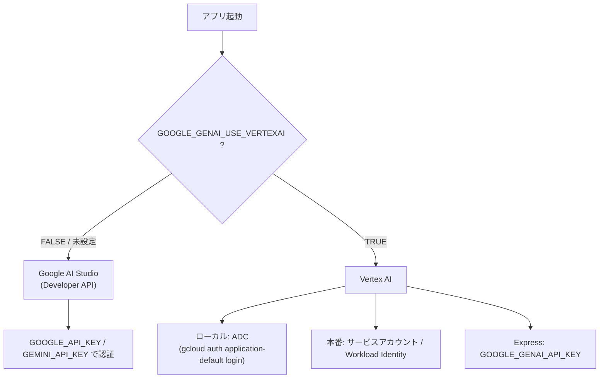
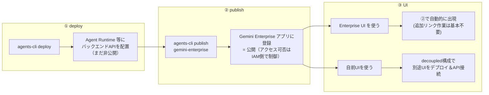
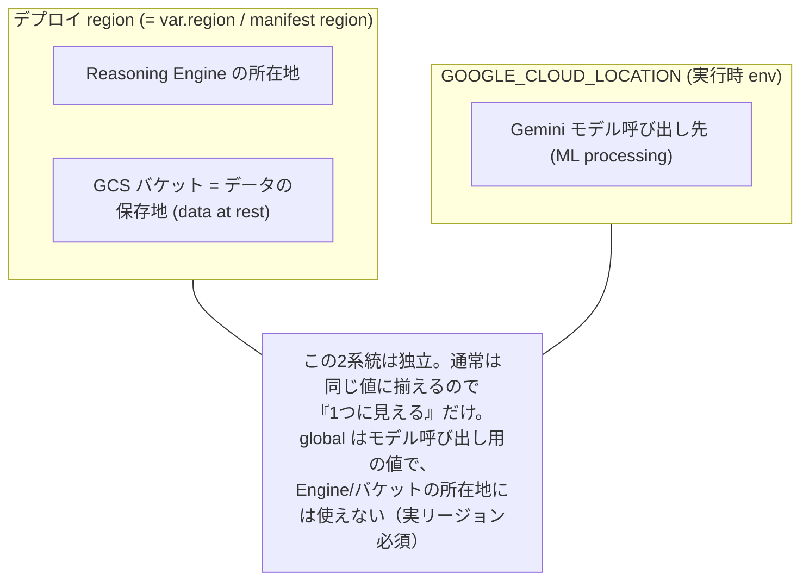
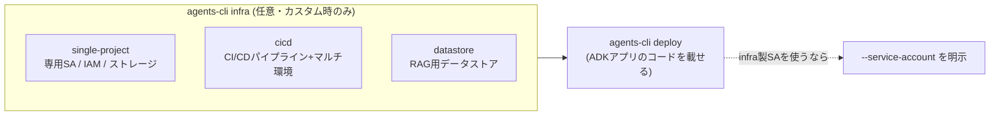
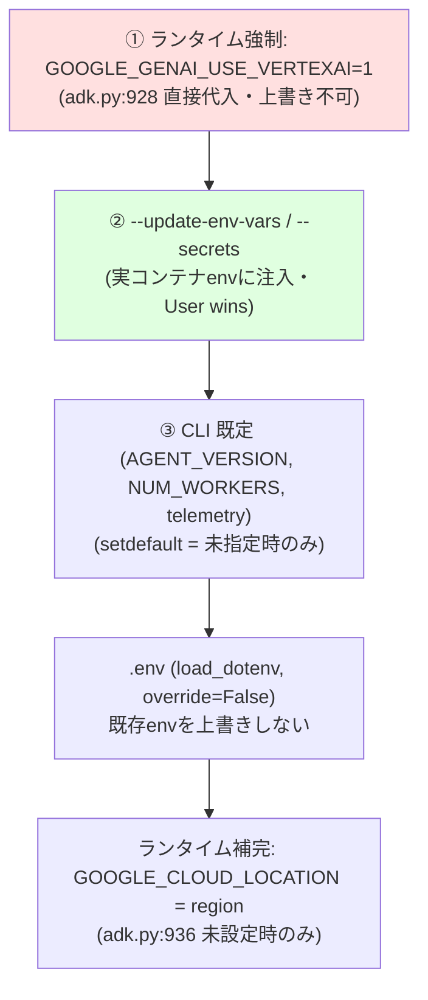
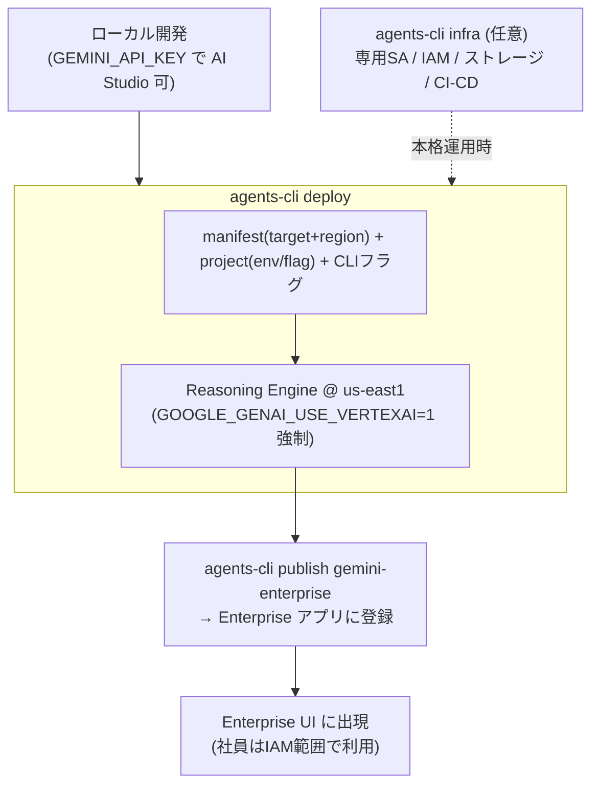

# ADK × Gemini Enterprise Agent Platform デプロイ Q&A

> このプロジェクト（Google ADK / Agent Runtime を使い、Gemini Enterprise Agent Platform へのデプロイを見据えたもの）で交わした疑問と回答を、話の流れ順にまとめたメモです。
>
> - **検証日**: 2026-06-26
> - **対象**: `agents-cli` v0.5.1 / デプロイ先 = **Agent Runtime**（旧 Vertex AI Agent Engine）
> - **このプロジェクトの主な設定**: `region: us-east1` / `deployment_target: agent_runtime` / `session_type: none`
> - **根拠**: Google 公式ドキュメント・ADK ドキュメント＋ローカルの `agents-cli` ソースコードおよび本プロジェクトの実ファイル（推測ではなく一次情報で確認済み）

---

## 目次

1. [認証：APIキー(AI Studio) と Vertex AI の違い](#1-認証apiキーai-studio-と-vertex-ai-の違い)
2. [社員が使えるようになるまでの流れ（deploy → publish → UI）](#2-社員が使えるようになるまでの流れdeploy--publish--ui)
3. [Agent Runtime の実体](#3-agent-runtime-の実体)
4. [サービスアカウントと IAM](#4-サービスアカウントと-iam)
5. [リージョン設定（GOOGLE_CLOUD_LOCATION とデータレジデンシー）](#5-リージョン設定google_cloud_location-とデータレジデンシー)
6. [設定はどこから来るか（manifest / env / TF_VAR / terraform）](#6-設定はどこから来るかmanifest--env--tf_var--terraform)
7. [infra と deploy の関係](#7-infra-と-deploy-の関係)
8. [デプロイ後のランタイム挙動（Vertex強制・env優先順位）](#8-デプロイ後のランタイム挙動vertex強制env優先順位)
9. [付録：チートシート](#9-付録チートシート)

---

## 1. 認証：APIキー(AI Studio) と Vertex AI の違い

### Q1-1. ローカルでは `GEMINI_API_KEY` だけで動いた。デプロイ時も同じでよい？

開発サーバーで `GEMINI_API_KEY` だけで動くのは「ローカル → **Google AI Studio (Gemini Developer API)** に直接つなぐ」最もシンプルな構成です。
本番（Gemini Enterprise を見据える場合）は **Vertex AI バックエンドに切り替える**のが一般的です。

切り替えの本体は **`GOOGLE_GENAI_USE_VERTEXAI`** という1つのフラグで、これは接続先だけでなく**認証モデルそのもの**を変えます。

| | AI Studio (Developer API) | Vertex AI |
|---|---|---|
| `GOOGLE_GENAI_USE_VERTEXAI` | `FALSE` / 未設定 | `TRUE` |
| 認証手段 | **API キー**（`GOOGLE_API_KEY` / `GEMINI_API_KEY`） | **ADC／サービスアカウント** |
| 必要な設定 | キーのみ | `GOOGLE_CLOUD_PROJECT` + `GOOGLE_CLOUD_LOCATION` |
| キーの扱い | キーで課金・認証 | キー不要（プロジェクト＋認可情報で課金・認証） |



> **未検証メモ**: AI Studio 側のキー名は `GOOGLE_API_KEY` と `GEMINI_API_KEY` の表記揺れがあります。実際にどちらを読むかは使用中の SDK / `.env` テンプレート依存なので、確実を期すならプロジェクト設定を確認すること。

---

## 2. 社員が使えるようになるまでの流れ（deploy → publish → UI）

### Q2-1. 「デプロイ → publish → UIリンク」という理解で合っている？

大枠は正しいですが、用語を正確にすると以下です。



要点：

- **① deploy** = Google ホストのマネージド基盤（第一候補 = **Agent Runtime**）に**エージェントAPIのバックエンドだけ**を載せる。この段階では社員からは見えない。
- **② publish** = `agents-cli publish gemini-enterprise` で**既存の Gemini Enterprise アプリにエージェントを登録**する。
  - ⚠️ **publish = 「誰でも全公開」ではない**。特定アプリへの紐づけであり、**誰がアクセスできるかは IAM / アプリ側のアクセス制御**で決まる。
  - 前提：先に Google Cloud Console で Gemini Enterprise アプリを作成しておく必要がある。
- **③ UI** = 自前UIを用意しない場合、**②で登録した時点で Enterprise UI 上に現れ**、独立した「リンク付け」工程は基本不要。
  - 自前UIを使う場合のみ、UI を別途デプロイして Agent Runtime のAPIに接続する **decoupled 構成**にする。

---

## 3. Agent Runtime の実体

### Q3-1. デプロイ作業 = バックエンドサーバーのデプロイ？ 実態はどの GCP サービス？

- **はい、バックエンドのデプロイ**です。ただし自分で管理する常駐サーバーではなく、**Google フルマネージドのサーバーレス基盤にエージェントコードを載せる**形。
- 実体は **Vertex AI Agent Engine（= Agent Runtime）** で、リソースは **Reasoning Engine**。
  - Terraform 上は `google_vertex_ai_reasoning_engine`（`my-agent/deployment/terraform/single-project/service.tf`）。
  - リソース名: `projects/PROJECT/locations/LOCATION/reasoningEngines/ENGINE_ID`
- **コンテナではなくソースベース**デプロイ（Dockerfile 不要、コードを tarball 化して送る）。
- **専用の `gcloud` CLI は無い**。デプロイは `agents-cli deploy`、照会は Python `vertexai.Client`。

---

## 4. サービスアカウントと IAM

### Q4-1. SA を渡さずにデプロイすると、SA と権限は自動で付く？ Vertex AI User は入る？

**2ケースに分かれる。**

**ケースA：`--service-account` を渡さない（Google マネージドのデフォルト）**

- Google 管理の **AI Platform Reasoning Engine Service Agent** が自動的に実行IDになる。
  - 形式: `service-PROJECT_NUMBER@gcp-sa-aiplatform-re.iam.gserviceaccount.com`
  - ロール: `roles/aiplatform.reasoningEngineServiceAgent`（デプロイ済みエージェントに必要な既定権限を含む。標準利用なら Gemini 呼び出しもこの範囲でカバー）

**ケースB：このプロジェクト（スキャフォールド済み）の専用 SA**

`my-agent/deployment/terraform/single-project/iam.tf` が専用 SA `my-agent-app` を定義し、`variables.tf` の `app_sa_roles` で以下を付与：

| ロール | 役割 |
|---|---|
| **`roles/aiplatform.user`** | **＝「Vertex AI User」。Gemini/Vertex モデル呼び出し権限** ✅ |
| `roles/logging.logWriter` | ログ書き込み |
| `roles/cloudtrace.agent` | トレース送信 |
| `roles/storage.admin` | GCS（アーティファクト/ログ） |
| `roles/serviceusage.serviceUsageConsumer` | API 利用 |

⚠️ **落とし穴**：
1. `iam.tf` は `agents-cli deploy` では自動適用されない。実体化するのは `agents-cli infra single-project --apply`（または CI/CD）を回したときだけ。
2. `agents-cli deploy` は専用 SA を**自動では使わない**。使うには `--service-account my-agent-app@PROJECT.iam.gserviceaccount.com` を**明示**する（渡さないとケースAにフォールバック）。

### Q4-2. ケースAの IAM は全自動？ マネージャーの管理作業は不要？

**「ベースラインだけ全自動。それ以外は人手（管理者）」** が正確。

- **自動な部分（マネージャー不要）**：サービスエージェントは Google Cloud が**自動生成**し、その専用ロールも**自動付与**する（コンソール操作・承認 不要）。
- **人手が必要な部分**：
  - プロジェクト存在・課金・API有効化・デプロイ実行者自身の権限（≒一度きりの前提整備）
  - エージェントが**他リソース（Secret Manager / 自前GCS / DB / VPC等）に触る**場合の追加ロール付与
  - ケースB の専用 SA 作成（Terraform を管理者が `infra` で適用）

➡️ 実務では「コンソールでポチポチ」ではなく **IAM を Terraform（コード）で記述 → レビュー → 適用** という形で管理作業が入る。

### Q4-3. ケースAでデモは作れる？

**作れる。** SA フラグなしで `agents-cli deploy` すれば、Gemini を呼ぶだけの基本エージェントは追加 IAM 作業なしで動く。
**＝デモ/PoC はマネージャー介在なしのセルフサービスで立ち上げ可能。** 本格運用に向かう段でケースB（専用SA + Terraform）へ移行する。

---

## 5. リージョン設定（GOOGLE_CLOUD_LOCATION とデータレジデンシー）

### Q5-1. `GEMINI_API_KEY` を使うときのリージョンは？

**選べない／処理地を制御・把握できない。**

- AI Studio（`generativelanguage.googleapis.com`）は**グローバルエンドポイント**で、**リージョン指定の概念なし**。
- **データレジデンシー（保存・処理地）の保証なし。** どこで ML 処理されるか制御も把握も不可。
- 公式の「Available regions」は「**どの国からAPIを使えるか**」のリストで、処理地とは別物。

➡️ residency や監査・VPC 制御が要るなら **APIキー方式は不適。Vertex AI に切り替える。**

### Q5-2. `GOOGLE_CLOUD_LOCATION` は何を決める？ global にすれば安全？

**重要：1つの変数で3つを一元決定…ではない。実際は2系統に分かれる。**

| 何を決めるか | 設定元 | 本プロジェクトの値 |
|---|---|---|
| エージェント(Reasoning Engine)のデプロイ地 ＋ データ保存地（GCS = data at rest） | **デプロイ region**（`agents-cli-manifest.yaml` の `region` / `--region` / Terraform `var.region`） | `us-east1` |
| **Gemini モデル呼び出し（ML処理）の問い合わせ先** | **`GOOGLE_CLOUD_LOCATION`**（実行時 env） | 実行時に解決 |



**global の正確な意味（data at rest と ML processing の区別）**：

- **Data at rest（保存データ）** … 選んだリージョンに留まり、**どのエンドポイント（global含む）を呼んでも移動しない**。
- **ML processing（推論処理）** … リクエストを送ったエンドポイントのリージョンで処理。**`global` はこの処理地を保証・特定できない**。

➡️ よって **「global = データ保存先として不適格」は誤り**。正しくは **「global = ML処理地の保証が無くなる」**。

**結論（global は「お勧めしない」ではなく要件次第）**：

| 状況 | 推奨 |
|---|---|
| ML処理地の規制要件が**無い**（デモ含む大半） | **`global`**（Google 推奨。可用性高く、モデル未提供404を避けやすい） |
| US/EU 内に留めたい | **`us` / `eu` マルチリージョン**（residency + 分散の中間解） |
| 厳格な単一リージョン縛り | `us-east1` 等。ただし**使うモデルがそのリージョンで提供されているか要確認**（未提供だと404 → 本プロジェクト `my-agent/CLAUDE.md` の「404なら global に」が該当） |

---

## 6. 設定はどこから来るか（manifest / env / TF_VAR / terraform）

### Q6-1. `agents-cli-manifest.yaml` とは？ 標準的で過不足ない？

`agents-cli scaffold create` が生成する**プロジェクト構成の記録ファイル**。以後の `agents-cli` コマンドがこれを読む。
CLI ヘルプにも *"deploy … Dispatches by deployment target configured in agents-cli-manifest.yaml"* と明記。

正規スキーマ（`_project.py` の `ProjectConfig`）と本プロジェクトを照合 → **標準的で実害のある不足なし**。
唯一 `create_params.is_a2a` が未記載だが、コードは `.get("is_a2a", False)` で読むので **A2Aでない標準ADKエージェントとして正しく false**。

➡️ **手編集は非推奨**。構成変更は `agents-cli scaffold enhance` を使う。

### Q6-2. region / project / TF_VAR はどう解決される？

CLI ソース（`_project.py`）で確認した優先順位：

**project（`resolve_gcp_project`）**
```
1. --project フラグ
2. GOOGLE_CLOUD_PROJECT 環境変数
3. ADC (GOOGLE_APPLICATION_CREDENTIALS / gcloud config 等)
```
→ **manifest に project フィールドは無い**。必ず別途与える。

**region（`resolve_gcp_region`）**
```
1. manifest の region   ← 最優先（本プロジェクト us-east1）
2. GOOGLE_CLOUD_LOCATION 環境変数
3. フォールバック us-west1
```
→ **manifest に region がある限り、deploy 地は us-east1。`GOOGLE_CLOUD_LOCATION` は deploy 地には効かない（manifest が勝つ）。** `GOOGLE_CLOUD_LOCATION` の役割は**実行時のモデル呼び出し先**。

**`TF_VAR_*`（例: `TF_VAR_project_id` / `TF_VAR_region` / `TF_VAR_project_name`）**
→ Terraform 標準の入力変数。**効くのは terraform 実行時（`infra single-project` / CI/CD）だけ**。`agents-cli deploy` の project/region 解決には**使われない**。

⚠️ **ケースAでデモを動かすなら `TF_VAR_*` ではなく `GOOGLE_CLOUD_PROJECT`（必要なら `--region`）を設定する。**

### Q6-3. `agents-cli deploy` だけのとき、terraform 設定は使われる？

**使われない**（Agent Runtime / Cloud Run の場合。※GKE のみ deploy が内部で terraform を呼ぶ例外あり）。

- 使われるのは **manifest（ターゲット＋region）＋ 別途与えた project ＋ CLI フラグ/既定値**のみ。
- `service.tf` の CPU/メモリ（cpu=4, memory=8Gi）等は **terraform 経路の値**で、`agents-cli deploy` は **CLI 既定（cpu=1, memory=4Gi, concurrency=8）** で動く（dry-run で実証）。
- ⚠️ **ケースAではデータベース/バケットは作られない**（`session_type: none` → in-memory、バケット無し → `InMemoryArtifactService`）。永続ストレージは terraform の担当。

---

## 7. infra と deploy の関係

### Q7-1. `agents-cli infra` で周辺を整えてから `agents-cli deploy` でアプリを載せる、で合っている？

**合っている。** ただし infra は3種類あり、`single-project` は任意。



要点：

- `infra single-project` は **任意**。基本デプロイ（ケースA）には不要（CLI ヘルプ: *"Not required for basic deployments"*）。専用SA・事前シークレット・特定IAMが要るときに使う。
- **既定では `terraform plan`（確認のみ）**。実作成は **`--apply`** を付けたとき（不可逆操作の安全策）。
- **Agent Runtime では infra と deploy は協調**（terraform は「別のデプロイ方法」ではなくインフラ供給役）。`service.tf` の `lifecycle.ignore_changes = [source_code_spec]` が「インフラ=terraform / コード=deploy・CI」の分業を表す。

```bash
# 1) 周辺インフラを確認 → 作成
agents-cli infra single-project            # plan で確認
agents-cli infra single-project --apply    # 作成

# 2) その上でコードをデプロイ（専用SAを使うなら明示）
agents-cli deploy --service-account my-agent-app@PROJECT.iam.gserviceaccount.com
```

---

## 8. デプロイ後のランタイム挙動（Vertex強制・env優先順位）

### Q8-1. デプロイ後は Vertex 前提？ AI Studio の API キーは効かない？

**YES、確定。** デプロイ後に Agent Engine 上で動く `AdkApp.set_up()`（`vertexai/agent_engines/templates/adk.py:928`）が：

```python
def set_up(self):
    ...
    os.environ["GOOGLE_GENAI_USE_VERTEXAI"] = "1"   # ← 無条件で強制
```

- **`GOOGLE_GENAI_USE_VERTEXAI = "1"` を起動時に無条件代入**（`.env` や `--update-env-vars` の `FALSE` も上書きされる）。
- ➡️ **デプロイ後は Vertex 経由でしか Gemini を呼べない。素の `GEMINI_API_KEY`（AI Studio）は効かない。** モデル呼び出しは SA/ADC で Vertex に対して行われる。
- 例外は **Vertex AI Express Mode**（`express_mode_api_key` ＋ project 無し）だけで、これも `USE_VERTEXAI=1` のまま＝AI Studio ではない。

> 対比：**ローカル開発では `GOOGLE_GENAI_USE_VERTEXAI` を自分で制御できる**ので AI Studio の `GEMINI_API_KEY` でも動く。デプロイすると Vertex 固定に変わる。

### Q8-2. `--update-env-vars` の優先度は？

**高い（"User wins"）。** `agents-cli` ソース（`deploy/agent_runtime.py:152`）に *"User `--update-env-vars` and `--set-secrets` win; everything else is [setdefault]"*。



実用上の含意：

- **`--update-env-vars GOOGLE_CLOUD_LOCATION=global` は尊重される**（ランタイムは `if "GOOGLE_CLOUD_LOCATION" not in os.environ` のときだけ region で補完するため、`adk.py:936`）。
- **`.env` は gitignore 済み**（tarball 同梱が保証されない）→ 本番で global を確実に効かせるなら `--update-env-vars` で明示するのが堅実。
- ただし **`GOOGLE_GENAI_USE_VERTEXAI` だけは強制上書きされ、変更不可。**

```bash
# ローカル開発・playground 用 → app/.env
GOOGLE_CLOUD_PROJECT=<project-id>
GOOGLE_GENAI_USE_VERTEXAI=TRUE
GOOGLE_CLOUD_LOCATION=global

# デプロイ済みエンジンに確実に渡す → deploy 時に明示
agents-cli deploy --update-env-vars GOOGLE_CLOUD_LOCATION=global
```

### Q8-3. `agent_guidance_filename: "CLAUDE.md"` とは？

**開発を手伝う AI コーディングアシスタント向けのガイドファイル名の記録。**
`scaffold/commands/create.py:155` のヘルプ: *"Filename for agent guidance (e.g., GEMINI.md, CLAUDE.md, AGENTS.md)"*。

- 既定 `GEMINI.md`。本プロジェクトは Claude Code 利用のため `CLAUDE.md`。実体は `my-agent/CLAUDE.md`（"Coding Agent Guide"）。
- **デプロイ後のエージェント実行とは無関係**。`scaffold enhance` / `upgrade` がどのガイドを維持すべきか知るためのメタ情報。

---

## 9. 付録：チートシート

### 環境変数早見表

| 変数 | 役割 | ケースAで必要か | 備考 |
|---|---|---|---|
| `GOOGLE_CLOUD_PROJECT` | デプロイ先プロジェクト | **必須** | manifest には無い。`--project` / gcloud config でも可 |
| `GOOGLE_GENAI_USE_VERTEXAI` | AI Studio / Vertex の切替 | ローカルのみ意味あり | **デプロイ後は `1` 強制**（変更不可） |
| `GOOGLE_CLOUD_LOCATION` | **モデル呼び出し先**（ML処理） | 任意（既定は engine region） | deploy 地には影響しない。global 可 |
| `GOOGLE_API_KEY` / `GEMINI_API_KEY` | AI Studio のキー | ローカルのみ | デプロイ後の標準経路では無効 |
| `TF_VAR_project_id` / `TF_VAR_region` / `TF_VAR_project_name` | Terraform 入力変数 | 不要 | **terraform 実行時のみ**有効 |

### コマンド早見表

| 目的 | コマンド |
|---|---|
| デモをデプロイ（ケースA） | `GOOGLE_CLOUD_PROJECT=<id> agents-cli deploy` |
| デプロイ内容を確認のみ | `agents-cli deploy --dry-run --no-confirm-project` |
| リソース増強 | `agents-cli deploy --cpu 4 --num-workers 4 --concurrency 16 --memory 16Gi` |
| 専用SAで本番寄りデプロイ | `agents-cli infra single-project --apply` → `agents-cli deploy --service-account <sa-email>` |
| Gemini Enterprise へ登録 | `agents-cli publish gemini-enterprise --gemini-enterprise-app-id <app>` |
| 実行時に global を強制 | `agents-cli deploy --update-env-vars GOOGLE_CLOUD_LOCATION=global` |

### 全体像



---

## 参考（Sources）

**公式ドキュメント**
- [Gemini models for ADK agents](https://adk.dev/agents/models/google-gemini/)
- [Managing access for deployed agents (Agent Engine)](https://docs.cloud.google.com/vertex-ai/generative-ai/docs/agent-engine/manage/access)
- [Service agents (IAM)](https://docs.cloud.google.com/iam/docs/service-agents)
- [Deployments and endpoints (global / regional / multi-region)](https://docs.cloud.google.com/vertex-ai/generative-ai/docs/learn/locations)
- [Data residency (data at rest と ML processing の区別)](https://docs.cloud.google.com/vertex-ai/generative-ai/docs/learn/data-residency)
- [Available regions for Google AI Studio and Gemini API](https://ai.google.dev/gemini-api/docs/available-regions)

**ローカル一次情報（コード）**
- `vertexai/agent_engines/templates/adk.py:928`（`GOOGLE_GENAI_USE_VERTEXAI=1` 強制）, `:936`（LOCATION 補完）, `:943`（Express Mode）
- `google/agents/cli/deploy/agent_runtime.py:152`（`--update-env-vars` 優先）
- `google/agents/cli/_project.py`（`ProjectConfig` スキーマ / `resolve_gcp_project` / `resolve_gcp_region`）
- `google/agents/cli/scaffold/commands/create.py:155`（`agent_guidance_filename`）
- 本プロジェクト: `my-agent/agents-cli-manifest.yaml` / `deployment/terraform/single-project/{service,iam,variables}.tf` / `app/agent_runtime_app.py` / `my-agent/CLAUDE.md`

**ローカルスキル**
- `google-agents-cli-deploy` / `google-agents-cli-publish`
