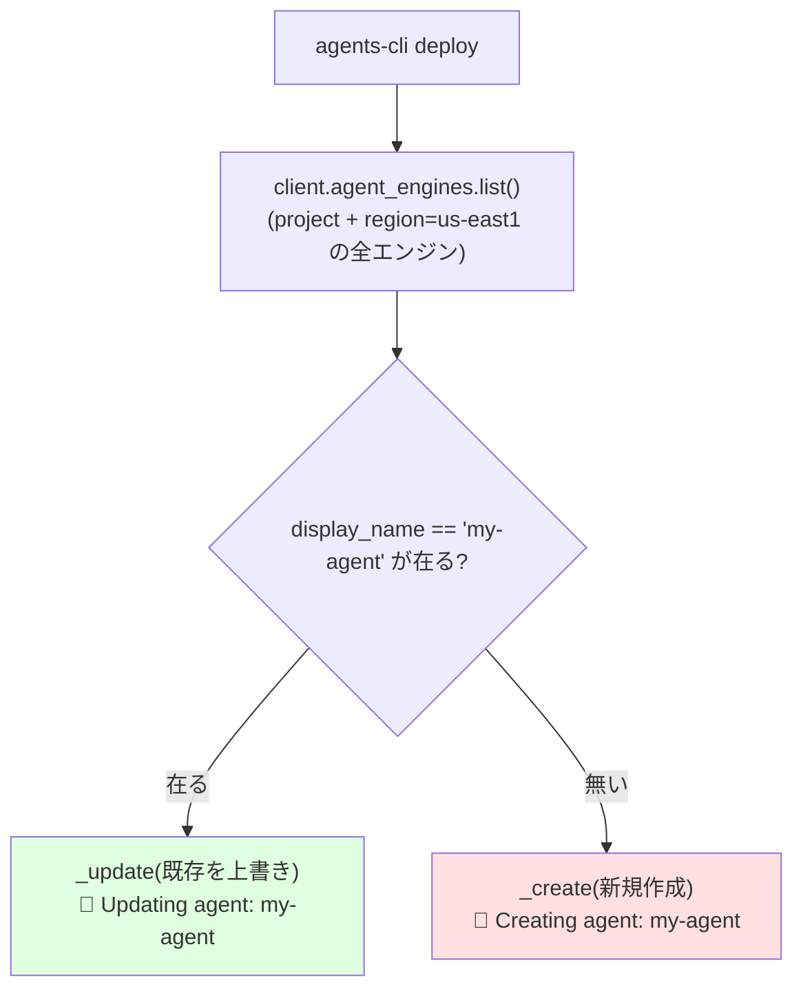
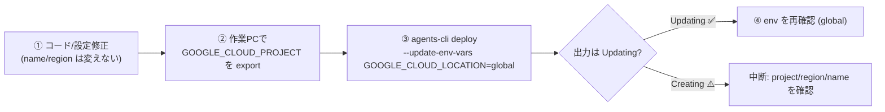

# ADK 再デプロイ（上書き）と検証ガイド

> 既に Agent Runtime にデプロイ済みのエージェント（`display_name: my-agent`）を、**新しいバージョンで上書き**するための手順と、その前に行う**検証方法**。
> 主目的の例：誤って `GOOGLE_CLOUD_LOCATION=us-east1` 相当でデプロイしてしまったモデル呼び出し先を **global** に直す＋その他の小修正。
>
> - **検証日**: 2026-06-26 / `agents-cli` v0.5.1 / デプロイ先 = Agent Runtime / region = us-east1
> - **根拠**: `agents-cli` ソース・`vertexai` SDK・aiplatform proto（推測ではなく一次情報で確認済み）

---

## 0. 結論（先に要点）

- **更新 vs 新規作成は `display_name`(=プロジェクト名 `my-agent`) で自動判定**される。同じ **project + region + display_name** なら**その場で上書き更新**。`deployment_metadata.json` には依存しない。
  （根拠: `deploy/agent_runtime.py:522-562`, `_start_deploy_operation:625-660`）
- 上書きを成立させる **3条件**：同じ **project** / 同じ **region(us-east1)** / 同じ **display_name(my-agent)**。どれかがズレると**重複作成**になる。
- **`GOOGLE_CLOUD_LOCATION` を global に直す ≠ deploy region を変える**。エンジンは **us-east1 のまま**、変えるのは**モデル呼び出し先**（実行時 env）。`--update-env-vars GOOGLE_CLOUD_LOCATION=global` で渡す。
- このdev container には **gcloud も認証も無い**ので、**デプロイ自体は作業PC**（昨日と同じ環境）で行う。コード編集はこのコンテナでOK。

---

## 1. 更新判定ロジック（なぜ「同じ名前なら上書き」なのか）

`agents-cli deploy`（Agent Runtime）は次の通り動く（`deploy/agent_runtime.py`）：

```python
existing_agents = list(client.agent_engines.list())              # project+location の全エンジンを列挙
matching_agents = [a for a in existing_agents
                   if a.api_resource.display_name == display_name]  # display_name 一致で判定
...
if matching_agents:
    client.agent_engines._update(name=matching_agents[0].api_resource.name, ...)  # 上書き更新
else:
    client.agent_engines._create(...)                            # 新規作成
```

- `display_name` = `service_name` = **プロジェクト名（manifest の `name: "my-agent"`）**（`--service-name` 未指定時）。
- `list()` は **指定した location（=deploy region）** のエンジンだけを返す。
- ➡️ **同 project・同 region(us-east1)・同名 `my-agent`** のエンジンがあれば、その**先頭をその場で更新**。



> 実行時に **`🚀 Updating agent: my-agent ...`** と出れば上書き成功。**`Creating`** と出たら 3条件のどれかがズレている合図 → 中断して project/region/name を確認。

---

## 2. 事前検証

### 2-1. 「terraform 製ではなく agents-cli deploy 製」であることを確認

terraform で作られたエンジンは `description = "Agent deployed via Terraform"`（`deployment/terraform/single-project/service.tf:24`）。agents-cli deploy 製は description が空など別の値。

作業PC（gcloud＋認証あり）から：

```bash
# 既存デプロイ一覧（存在確認）
agents-cli deploy --list
```

または Python で description まで確認：

```python
import vertexai
client = vertexai.Client(location="us-east1")
for a in client.agent_engines.list():
    r = a.api_resource
    print(r.display_name, "|", r.description, "|", r.name)
```

**判定**：
- `description` が `"Agent deployed via Terraform"` → **terraform 製**（→ `terraform apply` で更新すべき。`agents-cli deploy` で上書きすると二重管理になるので注意）
- 上記でない **かつ** `my-agent` が **1個だけ** → **agents-cli deploy 製。そのまま上書きでOK**

> `my-agent` が複数あると `_update` は `matching_agents[0]`（先頭）を更新し、どれが対象か曖昧になる。**1個であること**も必ず確認。

> このリポジトリには**ローカル terraform state が無い**ことは確認済み（=ここから terraform は適用していない）。ただし実体は別PCからのデプロイなので、上記でエンジン本体の description を見て確定すること。

### 2-2. 現在の `GOOGLE_CLOUD_LOCATION` を調べる

env は Reasoning Engine の **`spec.deploymentSpec.env`**（`{name, value}` のリスト）に入る（proto: `reasoning_engine.py:127-185`）。

**方法A：REST + curl（SDKバージョン非依存）**
```bash
ENGINE="projects/<PROJECT_ID>/locations/us-east1/reasoningEngines/<ENGINE_ID>"

# 全env
curl -s -H "Authorization: Bearer $(gcloud auth print-access-token)" \
  "https://us-east1-aiplatform.googleapis.com/v1/${ENGINE}" \
  | jq '.spec.deploymentSpec.env'

# GOOGLE_CLOUD_LOCATION だけ
curl -s -H "Authorization: Bearer $(gcloud auth print-access-token)" \
  "https://us-east1-aiplatform.googleapis.com/v1/${ENGINE}" \
  | jq '.spec.deploymentSpec.env[]? | select(.name=="GOOGLE_CLOUD_LOCATION")'
```
（`<ENGINE_ID>` は `agents-cli deploy --list` か `deployment_metadata.json` で取得。v1 で 404 の場合は `v1beta1` を試す）

**方法B：Python（vertexai SDK）**
```python
import vertexai
client = vertexai.Client(location="us-east1")
for a in client.agent_engines.list():
    res = a.api_resource
    if res.display_name != "my-agent":
        continue
    d = res.model_dump() if hasattr(res, "model_dump") else type(res).to_dict(res)
    env = (((d.get("spec") or {}).get("deployment_spec")) or {}).get("env") or []
    vals = {e.get("name"): e.get("value") for e in env}
    print("name:", res.name)
    print("GOOGLE_CLOUD_LOCATION:", vals.get("GOOGLE_CLOUD_LOCATION", "<未設定>"))
    print("all env:", vals)
```

**結果の読み方**：
| 結果 | 意味 |
|---|---|
| env に `GOOGLE_CLOUD_LOCATION` が**有る** | その値が明示設定されている（例: `us-east1`） |
| env に**無い** | 明示なし → ランタイムが engine region で補完（`adk.py:936`）＝**実効 us-east1** |
| `GOOGLE_GENAI_USE_VERTEXAI` は出ない | 実行時に `1` 強制（`adk.py:928`）。env には現れない |

➡️ どちらでも、再デプロイ時に `--update-env-vars GOOGLE_CLOUD_LOCATION=global` を渡せば env に明示され、確実に global になる。

---

## 3. 再デプロイ（上書き）手順

### 3-1. コード／設定を修正
- 「その他の小修正」もここで入れる。
- `agents-cli-manifest.yaml` の `name` と `region` は**変えない**（上書き条件の維持）。

### 3-2. 作業PC（gcloud＋認証あり）から上書きデプロイ

```bash
# project は manifest に無いので必須（昨日と同じプロジェクトID）
export GOOGLE_CLOUD_PROJECT=<昨日と同じプロジェクトID>

# 上書き ＋ モデル呼び出し先を global に修正
agents-cli deploy --update-env-vars GOOGLE_CLOUD_LOCATION=global
```

ポイント：
- `--service-name` は**付けない**（display_name=`my-agent` を維持）。
- `--region` で**変えない**（manifest の us-east1 のまま＝エンジンは us-east1 に居続ける）。
- 出力が **`🚀 Updating agent: my-agent`** であることを確認（`Creating` なら中断）。
- 5〜10分かかることあり。タイムアウト時は `agents-cli deploy --status` で追跡（server 側で継続している）。

### 3-3. 反映確認
- 2-2 の方法で `GOOGLE_CLOUD_LOCATION=global` が env に入ったことを確認。
- 必要なら `agents-cli run --url <engine-url> --mode adk "テスト"` で疎通確認。



---

## 4. 注意点まとめ

| 項目 | 要点 |
|---|---|
| 上書き条件 | **同 project + 同 region(us-east1) + 同 display_name(my-agent)** |
| 判定キー | `display_name`（`deployment_metadata.json` ではない） |
| region | **us-east1 のまま**。変えると別regionに新規作成（重複） |
| global 化 | deploy region ではなく **モデル呼び出し先**。`--update-env-vars GOOGLE_CLOUD_LOCATION=global` |
| `GOOGLE_GENAI_USE_VERTEXAI` | 実行時に `1` 強制。env で変更不可（AI Studio 不可） |
| 実行環境 | デプロイは**作業PC**（このdev containerは gcloud/認証なし）。編集はコンテナでOK |
| terraform製だった場合 | `agents-cli deploy` で上書きせず `terraform apply` で更新する |

---

## 参考（Sources）
- `google/agents/cli/deploy/agent_runtime.py:522-562`（display_name で update/create 判定）, `:625-660`（`_update(name=matching_agents[0]...)`）
- `vertexai/agent_engines/templates/adk.py:928`（`GOOGLE_GENAI_USE_VERTEXAI=1` 強制）, `:936`（`GOOGLE_CLOUD_LOCATION` を未設定時のみ region で補完）
- `google/cloud/aiplatform_v1/types/reasoning_engine.py:127-185`（`spec.deployment_spec.env` の構造）
- 本プロジェクト: `my-agent/agents-cli-manifest.yaml`, `deployment/terraform/single-project/service.tf:24`（terraform 製の description マーカー）
- 関連: [`ADK-deployment-QA.md`](./ADK-deployment-QA.md)
